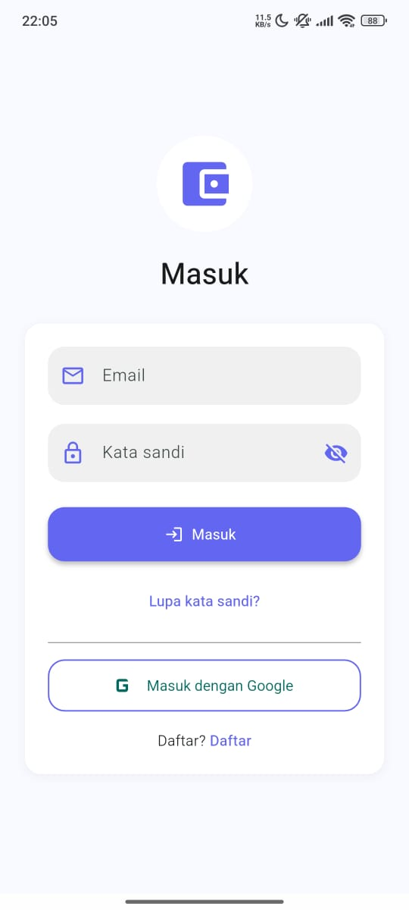
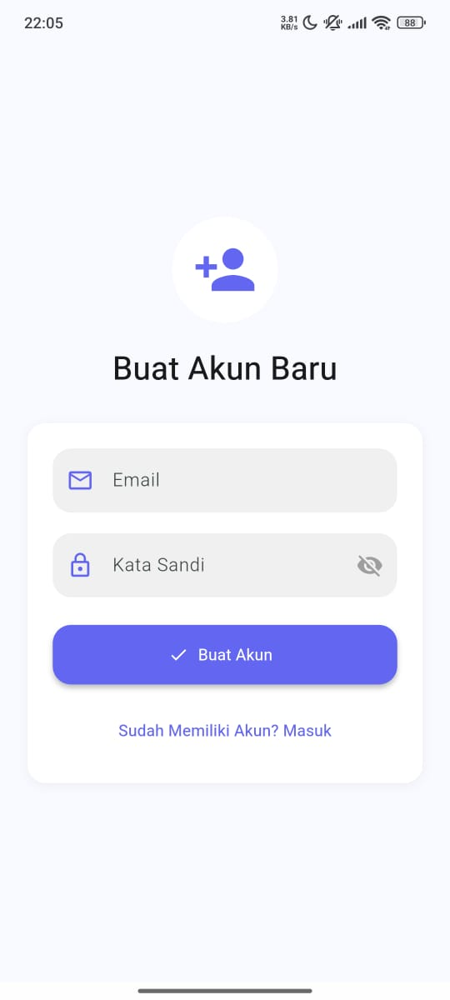

# CASQ

A modern Flutter project for authentication and image display.

<p align="center">
    
    
    
    
    
    
    
## Instalasi

Ikuti langkah-langkah berikut untuk menginstal dan menjalankan proyek ini:

1. **Clone Repository**
    ```bash
    git clone https://github.com/muris11/pencatatan-keuangan-cashq-.git
    cd pencatatan-keuangan-cashq-
    ```

2. **Install Dependencies**
    Jalankan perintah berikut untuk mengunduh semua dependensi yang dibutuhkan:
    ```bash
    flutter pub get
    ```

3. **Konfigurasi Firebase**
    - Buat project di [Firebase Console](https://console.firebase.google.com/).
    - Tambahkan aplikasi Android/iOS/Web sesuai kebutuhan.
    - Unduh file konfigurasi:
        - Android: `google-services.json` → letakkan di `android/app/`
        - iOS: `GoogleService-Info.plist` → letakkan di `ios/Runner/`
    - Aktifkan metode autentikasi Email/Password dan Google Sign-In di Firebase Authentication.

4. **Konfigurasi Penting Lainnya**
    - Pastikan folder `assets/images/` sudah tersedia untuk gambar.
    - Periksa dan sesuaikan konfigurasi di `pubspec.yaml` agar asset dan dependensi lain terdaftar dengan benar.
    - Pastikan koneksi internet aktif untuk integrasi Firebase dan autentikasi.

5. **Jalankan Aplikasi**
    Jalankan aplikasi dengan perintah:
    ```bash
    flutter run
    ```

## Fitur Lengkap

- **Autentikasi Pengguna**
    - Registrasi dengan email dan password
    - Verifikasi email setelah registrasi
    - Login dengan email/password
    - Login menggunakan Google Sign-In
    - Reset password melalui email
    - Logout

- **Integrasi Firebase**
    - Autentikasi menggunakan Firebase Authentication
    - Penyimpanan data pengguna di Firebase

- **Gallery Gambar**
    - Menampilkan gambar dari folder `assets/images` (1.jpg hingga 8.jpg)
    - Navigasi gambar secara responsif

- **UI Responsif**
    - Tampilan menyesuaikan berbagai ukuran layar (mobile, tablet, web)
    - Desain modern dan mudah digunakan

- **Manajemen Keuangan Pribadi**
    - Cocok untuk pencatatan keuangan sederhana
    - Fitur pencatatan transaksi (opsional, jika tersedia di aplikasi)

- **Struktur Folder Terorganisir**
    - Pemisahan kode berdasarkan fitur dan layanan
    - Mudah dikembangkan dan dipelihara

- **Dokumentasi & Sumber Daya**
    - Panduan instalasi dan penggunaan
    - Referensi dokumentasi Flutter dan Firebase

Dengan mengikuti langkah di atas, Anda dapat langsung menjalankan aplikasi dan menikmati seluruh fitur yang tersedia.
